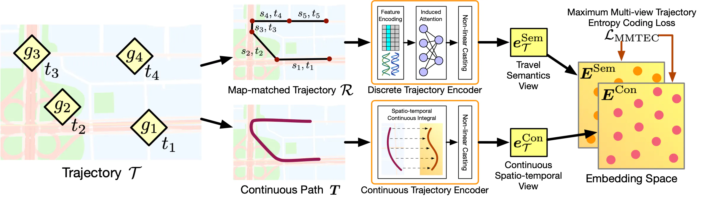

# Maximum Multi-view Trajectory Entropy Coding

Implementation of the Maximum Multi-view Trajectory Entropy Coding (MMTEC) for pre-training general trajectory embeddings.



Paper: Yan Lin, Huaiyu Wan, Shengnan Guo, Jilin Hu, Christian S. Jensen, and Youfang Lin. “Pre-Training General Trajectory Embeddings With Maximum Multi-View Entropy Coding.” IEEE Transactions on Knowledge and Data Engineering, 2023. https://doi.org/10.1109/TKDE.2023.3347513.

## Repository Structure

The code provided here is not only an implementation of MMTEC but also serves as a framework for contrastive-style pre-training and evaluating trajectory representations. It is designed to be easily extensible, allowing implemention of new methods.

### Pre-trainer and Pretext Loss

The pre-trainers and pretext losses are located in the `/pretrain` directory.

#### Pre-trainer

`/pretrain/trainer.py` includes commonly used pre-trainers:

- `Trainer`: An abstract class with common functions for fetching mini-batches, feeding mini-batches into loss functions, and saving/loading pre-trained models.
- `ContrastiveTrainer`: For contrastive-style pre-training.
- `MomentumTrainer`: A special version of contrastive-style pre-trainer implementing a momentum training scheme with student-teacher pairs.
- `NoneTrainer`: Reserved for end-to-end training scenarios.

#### Pretext Loss

`contrastive_losses.py` contain contrastive--style loss functions. These loss functions:

- Are subclasses of `torch.nn.Module`.
- Implement the loss calculation in their `forward` function.

Included pretext losses:
- Contrastive: Maximum Entropy Coding loss and InfoNCE loss.

### Representation Model

Encoder models are stored in the `/model` directory. Samplers for the encoders are in `/model/sample.py`.

### Downstream Tasks

Four downstream tasks are included for evaluating pre-training representation methods:

1. Classification (`Classification` class)
2. Destination prediction (`Destination` class)
3. Similar trajectory search (`Search` class)
4. Travel time estimation (`TTE` class)

These tasks are implemented in `downstream/trainer.py`. You can add custom tasks by implementing a new downstream trainer based on the abstract `Trainer` class. To add custom predictors for downstream tasks, add a new model to `downstream/predictor.py`.

### Dataset

The `Data` class in `data.py` helps with dataset pre-processing. It's recommended to pre-calculate and store trajectory sequences and labels for downstream tasks before experiments. You can do this by running `data.py` directly through Python.

> Note: The storage directory for metadata, model parameters, and results is controlled by the `Data.base_path` parameter. Adjust this according to your specific environment using command-line arguments.

The repository also includes sample datasets in the `sample/` directory for quick testing and demonstration purposes.

> Note: While these samples are useful for initial testing, they may not be representative of the full datasets' complexity and scale. For comprehensive experiments and evaluations, it's recommended to use complete datasets with the same file format.

### Configuration File System

Configuration files (JSON format) in the `/config` directory control all experiment parameters. To specify a config file during experiments, use the following command:

```bash
python main.py -c <config_file_path> --device <device_name> --base <base_path> --dataset <dataset_path>
```

## Getting Started

1. Install the required dependencies:

```bash
pip install -r requirements.txt
```

2. Prepare your dataset and adjust the `Data.base_path` in `data.py` to point to your data storage location.

3. Pre-process your data by running:

```bash
python data.py
```

4. Create or modify a configuration file in the `/config` directory to set up your experiment.

5. Run the main script with your chosen configuration:

```bash
python main.py -c config/your_config.json --device <device_name> --base <base_path> --dataset <dataset_path>
```

## Extending the Framework

To implement a new pre-training method or downstream task:

1. Add new loss functions in `/pretrain/contrastive_losses.py`.
2. Implement new models in the `/model` directory.
3. For new downstream tasks, add a new trainer class in `downstream/trainer.py` and corresponding predictors in `downstream/predictor.py`.

## Contacts

If you have any further questions, feel free to contact me directly. My contact information is available on my homepage: https://www.yanlincs.com/